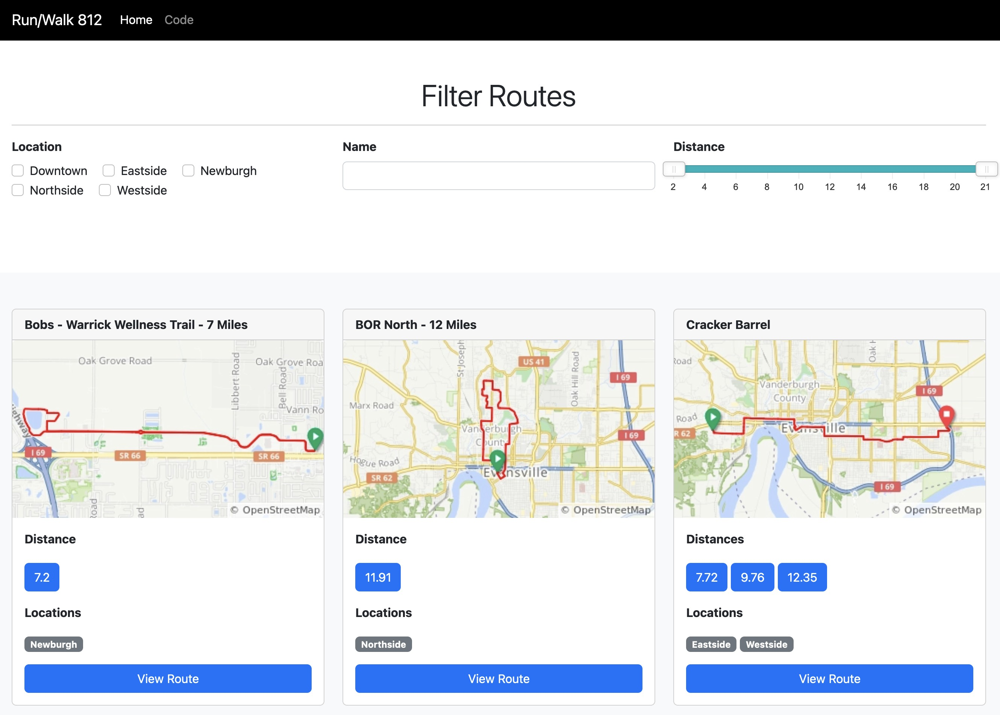
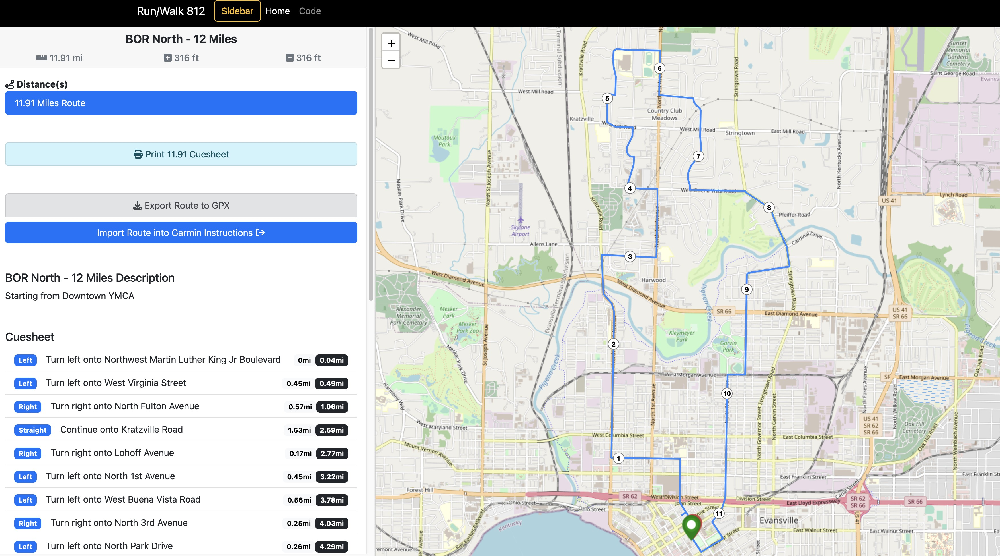
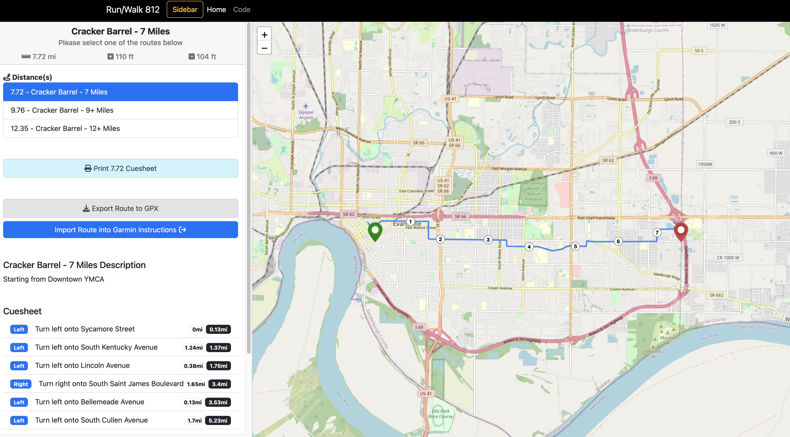
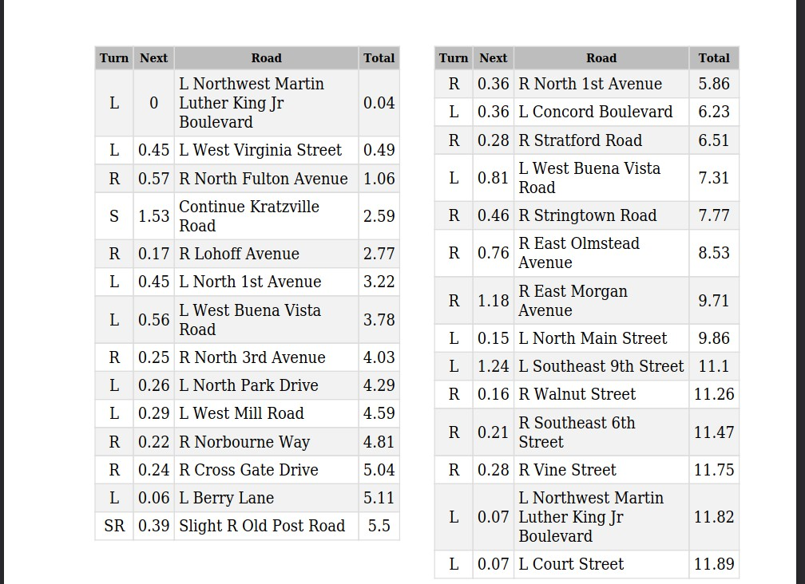

# Run 812 Routes
This is a "simple" application to organize running routes in the tristate area. 
It uses PHP, Symfony as the framework, for the backend and Bootstrap for the frontend. 
The Javascript is vanilla. The website fetches routes from Ride With GPS.

## Homepage

## Route View

## Route Collection View

## PDF View

Currently, the application can do the following:
- Fetch routes from Ride With GPS
- Store those routes in a database
- Display routes in a simple and easy to use view
  - Filter routes by location, name, or distance
  - View routes and collections of routes
  - View a thumbnail of the route
  - See next scheduled route on the homepage
- Display individual routes
  - Display mile markers on routes
  - Display directions on routes
  - Export the cue, direction, sheet to a PDF for easy printing
  - Export the route to a GPX file to import into your watch or other program
  - View the route on Open Street Maps
- Manage events, route collections, locations, and fetch a new data set of routes from Ride With GPS
  - Events can be created with a route collection to display on the homepage
  - Route collections are a collection of similar routes that vary in distance
  - Locations are just general locations for filtering routes on the view all routes page

## Running the program
Docker is the recommended way of running the program on your local computer. 
Current requirements:
- PHP 8.1
- MySQL Database
- `.env` needs to be copied to `.env.local` and values need to be updated

### Helpful commands
`docker-compose up` - Runs the `docker-compose.yaml` file and generates the environment
It consists of PHP 8.1, Nginx, and MySQL

`docker-compose run encore npm install` - Installs npm dependencies

`docker-compose run encore npm install --save <package_name>` - Installs package to package.json

`docker-compose run encore npm run watch` - Builds JS dependencies and watches for changes

`docker-compose run encore npm run build` - Builds everything for PROD or live environment

#### After docker-compose up...
`docker-compose exec php composer require <package_name>` - to install a dependency

`docker-compose exec php ./vendor/bin/phpunit` - Run tests

`XDEBUG_MODE=coverage docker-compose exec php ./vendor/bin/phpunit --coverage-html html` - Run phpunit tests and generate =code coverage
*xdebug.ini* will need to be updated with `xdebug.mode=coverage` 

`docker-compose exec php ./bin/console ...` - Execute Symfony console commands

`docker-compose exec php ./bin/console routes:download` - Download and store all the routes from Ride With GPS. This requires a valid login and API access.

`docker-compose exec php ./bin/console user:create <email> <password>` - Creates a new user in the database
